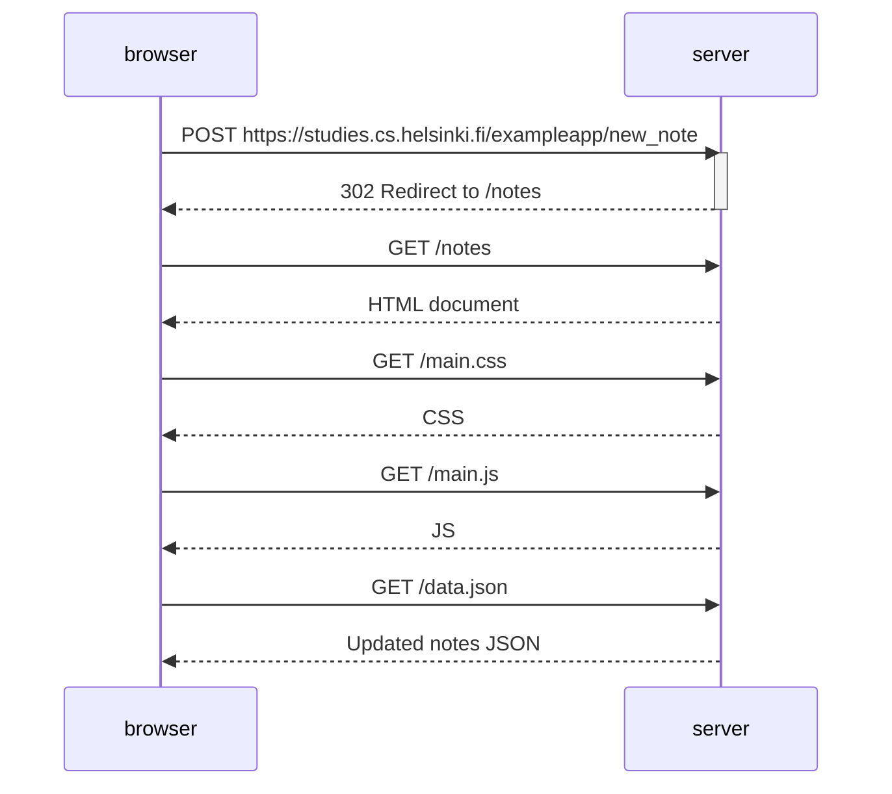

```mermaid
sequenceDiagram
    participant browser
    participant server

    browser->>server: POST https://studies.cs.helsinki.fi/exampleapp/new_note
    activate server
    server-->>browser: 302 Redirect to /notes
    deactivate server

    browser->>server: GET /notes
    server-->>browser: HTML document

    browser->>server: GET /main.css
    server-->>browser: CSS

    browser->>server: GET /main.js
    server-->>browser: JS

    browser->>server: GET /data.json
    server-->>browser: Updated notes JSON
```
